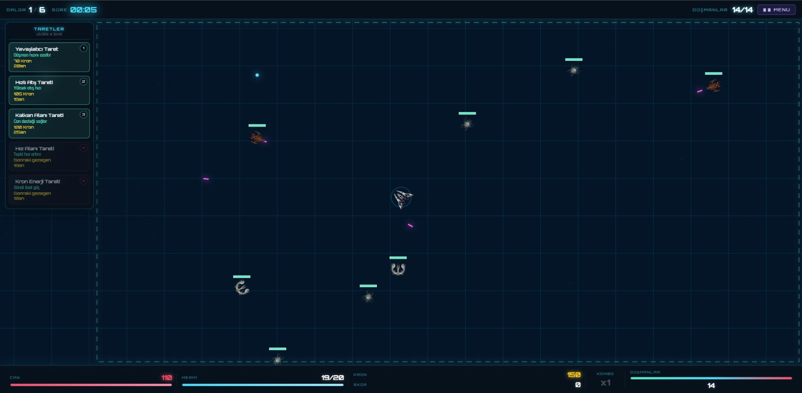
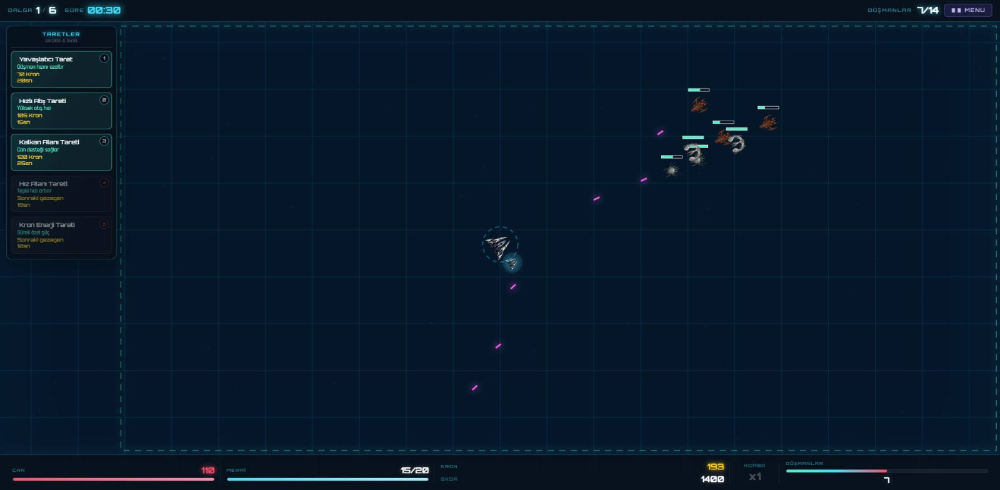
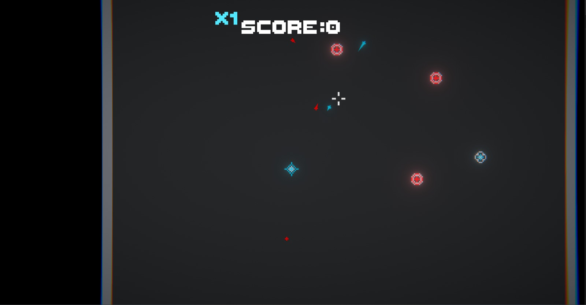
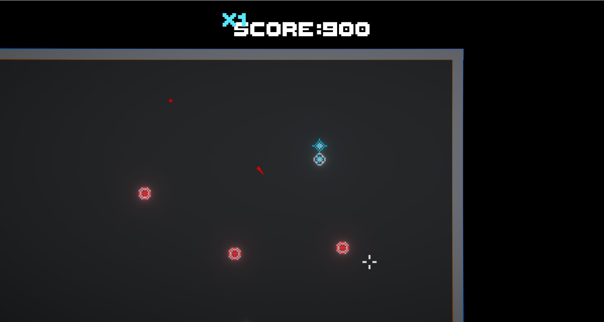

# Space War: Galaktik Savunma

Space War; HTML5 Canvas, CSS ve vanilla JavaScript ile geliştirilmiş bir 2D uzay temalı savunma oyunudur. Oyunumuzda hazır bir oyun motoru kullanılmamıştır; hareket, çarpışma, düşman dalgaları, taret davranışları ve arayüz akışı proje içindeki JavaScript modülleriyle yönetilmektedir. Temel oynanış canvas üzerinde çalışır. Oyuncu gemisini hareketli bir savaş alanında yönetirken düşman dalgalarını durdurmaya, çekirdeği korumaya ve Kron kaynaklarını doğru zamanda doğru savunma seçeneklerine harcamaya çalışır.

Oyunda pilot, Aether çekirdeklerini ele geçirmek isteyen Gölge Ordusu'na karşı savaşır. Astra, Vega ve Nora sistemleri galaksinin son savunma hatlarıdır. Kron Eğlence Modu ise klasik bölüm düzeninden ayrılır ve oyuncuyu zorluğu giderek artan sonsuz düşman dalgalarının içine bırakır.

## Oyun Amacı

Oyunumuzda Astra ve Kron Eğlence Modu baştan açıktır. Vega ve Nora gezegenleri ise sırasıyla diğer gezegenlerdeki tüm düşman dalgaları temizlendikten sonra açılır. Oyuncu önce bir gezegen seçer, ardından savaş başlamadan önce açık taretlerin ve özelliklerinin olduğu bilgilendirme ekranı açılır, ardından oyuna başlar. Dalga bilgisi ekranda görünür; bu yüzden hangi düşman tiplerinin geleceğini tahmin ederek stratejinizi ona göre kurmanız önemlidir.

Savaş başladığında hedef basittir, ancak her dalgada giderek zorlaşır. Amaç geminizle düşmanlara karşı koymak ve çekirdeği(gezegeni) korumaktır. Bunun için düşmanları durdurmalı, Kron(oyun parası) kazanmalı ve mümkün olduğunca yüksek skor kazanmalısınız. Kazandığınız Kronlar ile yeni taretler alarak savunmanızı güçlendirebilirsiniz. Ayrıca bazı düşmanlar yok edildikten sonra yardımcı modüller de oyuncuya yardımcı olmaktadır. Kron Eğlence Modu'nda ise bölüm bitişi yoktur. Her yeni dalgada düşman sayısı, dayanıklılık, hız ve özel düşman ihtimali artar.

Oyuncu gemisi, düşman rotaları, gezegen arka planları, yıldızlı uzay atmosferi, taret menzilleri, can barları, mermiler, ses efektleri ve HUD bilgileri aynı anda çalışarak daha canlı bir savunma alanı oluşturur. Oyuncunun aynı anda hareket etmesi, nişan alması, ateş etmesi, yeniden doldurma zamanını takip etmesi ve taretleri doğru noktaya yerleştirmesi gerekir. Bu yapı sayesinde oyun sadece refleks isteyen bir ateş etme deneyiminden ziyade kaynak yönetimi, konum alma ve dalga kontrolü gerektiren daha stratejik bir yapı taşımaktadır.

## Öne Çıkan Özellikler

- HTML5 Canvas üzerinde çalışan yıldızlı uzay sahnesi.
- Astra, Vega, Nora ve Kron olmak üzere dört farklı oyun rotası.
- Savaş öncesi taret yerleştirme ve dalga inceleme ekranı.
- Kron maliyeti, can değeri ve her birinin kendine ait bir rolü bulunan beş taret tipi.
- Bazı düşman askerleri yok ettikten sonra düşen ve kullanıcı aldıktan sonra ekstra atış desteği sağlayan modüller.
- Skor, süre, dalga, mermi, can, kombo ve kalan düşman bilgisini gösteren HUD.
- Müzik ve ses efekti kontrolleri.
- Düşman tiplerine göre değişen Kron ve skor ödülleri.
- Kron Eğlence Modu için sonsuz ilerleyen zorluk yapısı.
- Klavye ve fareyi birlikte kullanan akıcı hareket, nişan, ateş ve taret yerleştirme sistemi.
- Chrome ve Firefox üzerinde yerel sunucu ile oynanabilecek tarayıcı tabanlı yapı.

## Hikaye

Yıl 2450. İnsanlık, derin uzayın karanlık bölgelerinde Aether adı verilen kadim enerji çekirdeklerini (gezegenleri) bulur. Bu keşif büyük bir sıçrama gibi görünürken, galaksinin ötesinde bin yıldır uyuyan Gölge Ordusu'nu da uyandırır.

Işıksız boşluktan gelen mekanik istilacılar tüm ışığı yutmak ister. Astra, Vega ve Nora bu karanlığa karşı kalan son kalelerdir. Pilot, gemisi ve kurduğu savunma araçlarıyla, gemisine saldıran tüm düşmanları yok etmeye çalışır.

## Kontroller

| Kontrol | İşlev |
|---|---|
| `W`, `A`, `S`, `D` | Gemiyi hareket ettirir. |
| Fare hareketi | Nişan yönünü belirler. |
| Sol tık | Ateş eder. |
| `Space` | Alternatif ateş tuşudur. |
| `R` | Mermiyi yeniden doldurur. |
| Taret kartları (sürükle-bırak) | Tareti uygun canvas alanına yerleştirir. |
| Ses butonları | Müzik ve efektleri açıp kapatır. |
| `Escape` veya `Enter` | Oyun bitti ekranından menüye döner. |

Kontroller klavye ve fare birlikte kullanılacak şekilde tasarlanmıştır. Klavye gemi hareketi, ateş alternatifi, yeniden doldurma ve menü dönüşü gibi hızlı aksiyonları yönetirken; fare nişan alma, sol tıkla ateş etme ve taretleri sürükle-bırak yöntemiyle yerleştirme işlemlerini sağlar.

## Gezegenler

| Gezegen | Zorluk | Dalga Yapısı | Başlangıç Kron | Açık Taret |
|---|---:|---|---:|---:|
| Astra | Kolay  | Daha yavaş, temel düşman ağırlıklı savunma senaryosu.           | 300 | 2 |
| Vega  | Orta   | Normal, hızlı ve zırhlı düşmanları daha dengeli karıştırır.     | 380 | 3 |
| Nora  | Zor    | Yoğun dalgalar, özel düşmanlar ve boss ihtimaliyle baskı kurar. | 470 | 4 |
| Kron  | Sonsuz | Her dalgada büyüyen ve bitmeyen eğlence modu.                   | 560 | 6 |

Astra daha öğretici bir giriş sunarken, Vega ve Nora giderek sertleşen dalga yapılarıyla oyuncuyu farklı taret kombinasyonları kurmaya zorlar; Kron Eğlence Modu ise sonsuz dalga yapısıyla skor ve dayanma süresine odaklanır. Oyunda tercih edilen gezegen seçimini oyuncuya hissettirmek için her gezegende düşman davranışları, dalga yoğunluğu ve savunma ihtiyacı üzerinde etkili olan farklı zorluk akışları sunulmaktadır. Bu sayede oyuncu gezegenlerde ilerledikçe zorluğun giderek arttığını hissetmesi sağlanır.

## Oyuncu Gemisi

Oyuncu gemisi savaş alanında `W`, `A`, `S`, `D` tuşlarıyla hareket eder ve fare imlecinin bulunduğu yöne dönerek ateş eder. Gemi temel olarak 48x48 boyutunda kullanılır. Normal gezegenlerde hareket hızı `2.2`, Kron Eğlence Modu'nda ise sonsuz dalga yapısına uyum sağlaması için `2.35` olarak ayarlanmıştır. Hız Alanı Tareti etkisindeyken geminin hareket hızı geçici olarak `1.55` katsayıyla artar.

| Gezegen | Oyuncu Canı | Gemi Hızı |
|---|---:|---:|
| Astra | 100 | 2.2 |
| Vega  | 110 | 2.2 |
| Nora  | 120 | 2.2 |
| Kron  | 140 | 2.35 |

Oyuncu canı düşman temasları ve lazer saldırılarıyla azalır. Can sıfıra düşerse bölüm sona erer. Gemi, HUD panellerinin altına girmeyecek şekilde sınırlandırılmıştır; bu sayede oyuncu savaş sırasında gemiyi, mermileri ve gelen düşmanları daha rahat takip eder.

## Taretler

| Taret | Rol | Kron | Can | Etki Alanı / Menzil | Kısa Açıklama |
|---|---|---:|---:|---:|---|
| Yavaşlatıcı Taret    | Kontrol          | 60  | 130 | 180 | Menziline giren düşmanları kısa süreliğine yavaşlatır. |
| Hızlı Atış Tareti    | Seri hasar       | 90  | 115 | 520 | Düşük hasarlı fakat hızlı atış yapan savunma birimidir. |
| Kalkan Alanı Tareti  | Destek           | 130 | 180 | 150 | Belirli bir alanda oyuncunun savunma gücünü artırır. |
| Hız Alanı Tareti     | Hareket desteği  | 160 | 140 | 155 | Oyuncunun hareket ve tepki hızını yükseltir. |
| Kron Enerji Tareti   | Özel güç         | 210 | 120 | 145 | Kısa süreli sınırsız enerji desteği verir. |

Taretlerin yalnızca fiyatı yoktur; her birinin can değeri ve etki alanı da bulunur. Düşmanlar taretlerinize hasar verebilir. Bu yüzden taret yerleşimi, sadece nereye ateş edileceğini değil, hangi hattın ne kadar süre dayanacağını da belirler. Oyuncu gemisi, farklı düşman tipleri, savunma taretleri, çekirdek, mermiler, gezegen görselleri, imleç, ses kontrolleri ve dalga bilgisi gibi nesneler birlikte kullanılarak oyun alanı daha okunabilir ve daha hareketli hale getirilir.

## Düşmanlar ve Ödüller

Oyunda beş düşman tipi vardır. Zayıf birimler daha sık gelirken, özel zırhlı düşmanlar ve boss benzeri düşmanlar daha yüksek tehdit oluşturur. Düşmanlar yok edildiğinde türüne göre puan ve Kron kazandırır; skor ödülleri ise kombo sistemiyle daha anlamlı hale gelir.

| Tip | Tanım | Can | Hız | Saldırı Türü | Kron Ödülü | Skor |
|---|---|---:|---:|---|---:|---:|
| 1 | Zayıf düşman          | 45  | 0.90 | Temas hasarı | 5  | 100 |
| 2 | Zırhlı düşman         | 105 | 0.55 | Aralıklı lazer atışı ve temas hasarı | 10 | 160 |
| 3 | Hızlı düşman          | 70  | 0.80 | Zikzak hareketle temas hasarı | 10 | 180 |
| 4 | Özel zırhlı düşman    | 160 | 0.45 | Can yenileme ve temas hasarı | 20 | 280 |
| 5 | Boss veya özel düşman | 220 | 0.38 | Destek düşman çağırma ve temas hasarı | 50 | 600 |

Bu değerler düşmanların temel değerleridir. Çekirdeklerde zorluk seviyesine ve dalga sayısına göre düşmanların canı ve hızı belirli çarpanlarla artar; Kron Eğlence Modu'nda bu artış sonsuz dalga yapısı nedeniyle daha uzun süre devam eder.

## Teknolojiler

- HTML5
- CSS3
- Vanilla JavaScript
- ES6 module yapısı
- HTML5 Canvas API
- Google Fonts: Orbitron ve Rajdhani

Ana dosya `index.html` içindedir. Oyun döngüsü `js/main.js` tarafından çalıştırılır; oyuncu, düşman, mermi, arayüz, ses ve seviye davranışları ise `js/core` ve `js/levels` klasörlerine ayrılmıştır.

| Teknoloji | Nerede Kullanılır? |
|---|---|
| HTML5 | Sayfa iskeleti, menüler, HUD alanları ve oyun canvas'ı için kullanılır. |
| CSS3 | Gezegen seçim ekranı, animasyonlar, HUD, butonlar ve duyarlı arayüz düzenini yönetir. |
| Vanilla JavaScript | Oyun döngüsü, çarpışmalar, düşman davranışları, taret sistemi ve kullanıcı etkileşimlerini çalıştırır. |
| ES6 module yapısı | Kodun `js/core` ve `js/levels` altında parçalara ayrılıp yönetilebilir kalmasını sağlar. |
| HTML5 Canvas API | Gemi, düşmanlar, mermiler, taret alanları, yıldız arka planı ve efektlerin çiziminde kullanılır. |
| Google Fonts | Orbitron ve Rajdhani fontlarıyla bilim kurgu arayüz kimliği oluşturur. |

## Proje Yapısı

```text
SpaceWarRepo/
├── assets/images/        # Gemi, düşman, gezegen ve ekran görüntüleri
├── audios/               # Müzik ve ateş sesi dosyaları
├── css/style.css         # Arayüz, HUD, gezegen ve animasyon stilleri
├── docs/                 # Hikaye, geliştirme notları ve bölüm raporları
├── js/core/              # Oyun mekaniğini taşıyan temel modüller
├── js/levels/            # Astra, Vega, Nora ve Kron gezegenlerinin ayarları
├── index.html            # Ana HTML dosyası
└── README.md             # Proje tanıtımı
```

## Çalıştırma

Proje ES module kullandığı için dosyayı doğrudan çift tıklamak yerine küçük bir yerel sunucu ile açmak daha sağlıklıdır.
Python kuruluysa proje klasöründe şu komutu çalıştırabilirsiniz:

```bash
python -m http.server 4174
```

Ardından Chrome veya Firefox tarayıcısından şu adresi açın:

```text
http://127.0.0.1:4174/  veya http://localhost:4174
```

Node.js kullananlar için benzer şekilde herhangi bir statik sunucu da yeterlidir. Oyun test edilirken gemi hareketi, fareyle nişan alma, sol tık ve `Space` ile ateş etme, `R` ile yeniden doldurma, taret sürükle-bırak davranışı, ses butonları ve oyun bitti ekranından menüye dönüş davranışı iki tarayıcıda da kontrol edilmelidir.

## Ekran Görüntüleri







## Kullanılan Asset ve Sesler

- Oyuncu gemisi: `assets/images/gemi.png`
- Düşman görselleri: `assets/images/dusman1.png` - `assets/images/dusman5.png`
- Gezegen görselleri: `assets/images/gezegen1.png` - `assets/images/gezegen4.png`
- İmleç: `assets/images/imlec.png`
- Başlangıç müziği: `audios/oyun_muzgı_baslangic.mp3`
- Sakin oyun müziği: `audios/oyun_muzgı_sakinOyun.mp3`
- Aksiyon müziği: `audios/oyun_muzgı_aksiyon.mp3`
- Ateş efekti: `audios/atis_sesi_anlik.mp3`

## Referans Oyun

Projede örnek oyun olarak Modular Defense incelenmiştir: [https://michal23.itch.io/modular-defense](https://michal23.itch.io/modular-defense)

Space War ile bu referanstaki modüler savunma ve dalga baskısı fikrini uzay temalı, gezegen seçimine dayanan bir yapıya uyarlanmıştır. Sonuçta referans oyundan farklı olarak, kendi Kron ekonomisi ve taret düzeniyle çalışan ayrı bir oyun dinamiği oluşturulmuştur.

## Bağlantılar

- GitHub repo: [https://github.com/bilaldogru/SpaceWarRepo](https://github.com/bilaldogru/SpaceWarRepo)
- Yerel test adresi: [http://127.0.0.1:4174/](http://127.0.0.1:4174/) - [http://localhost:4174/](http://localhost:4174/)

## Geliştirme Notları

`docs/eksiklikler.md` içinde oyunun geliştirilmesi için öneriler tutulur. Öne çıkan başlıklar arasında ekran sarsıntısı, dalga arası kısa nefes süresi, satın alma kurallarının daha görünür anlatılması, düşman görsellerinin çeşitlendirilmesi ve mobil destek yer alır. `docs/AI.md`, yapay zeka ile yapılan düzenlemelerin istek, uygulama ve test özetini kaydeder. `docs/Hikaye.md` ve `docs/Hikaye.txt`, oyunun evrenini ve Hakkında bölümünde kullanılan hikaye metnini içerir. `docs/Vega.md`, `docs/Nora.md` ve `docs/Kron.md` ise ilgili gezegenlerin oynanış, denge ve teknik değişiklik notlarını açıklar.

Bu notlar projenin genişlemeye açık olduğunu gösterir. Belirlenen iyileştirmeler özellikle oyun hissi, öğretici akış ve tekrar oynanabilirlik tarafında değer katacaktır.

### Hazır Kullanılan Assetler

1-) Crosshair: https://www.flaticon.com/free-icon/crosshair_1527735
2-) Kron: https://www.magnific.com/free-psd/stunning-3d-render-ringed-planet-celestial-body-cosmic-wonder_406447035.htm#fromView=keyword&page=1&position=0&uuid=660d52f0-f12a-4157-a621-f754fd61eec4&query=Planet+png
3-) Vega: https://www.pngegg.com/en/png-vonsn
4-) Astra: https://www.vecteezy.com/png/49377734-purple-planet-on-transparent-background-cutout
5-) Nora: https://www.vecteezy.com/png/46335103-alien-planet-with-vegetation

Oyun sesleri yapay zeka ile oluşturulmuştur.
