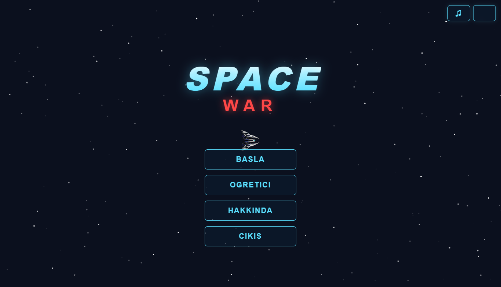
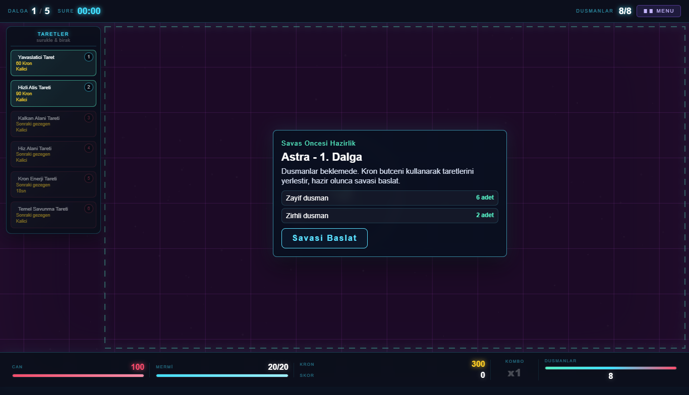

# Space War: Galaktik Savunma

Space War, HTML5 Canvas, CSS ve vanilla JavaScript ile geliştirilmiş tek sayfalık bir uzay savunma oyunudur. Projede hazır JavaScript oyun kütüphanesi veya oyun motoru kullanılmamıştır; temel oynanış canvas üzerinde çalışır.

## Oyun Amacı

Oyuncu Astra, Vega, Nora veya Kron Eğlence Modu arenasını seçer. Savaş başlamadan önce Kron bütçesiyle taretlerini haritaya yerleştirir, gelecek düşman dalgasını inceler ve hazır olduğunda savaşı başlatır. Amaç düşman dalgalarını durdurmak, çekirdeğin canını korumak ve olabildiğince yüksek skor kazanmaktır.

Kron Eğlence Modu sonsuz moddur. Her dalgada düşman sayısı, hızı, canı ve özel düşman gelme olasılığı artar. Oyuncu daha fazla Kron kazanır ama zorluk da sürekli yükselir.

## Kontroller

- `W`, `A`, `S`, `D`: Gemiyi hareket ettirir.
- Fare hareketi: Nişan yönünü belirler.
- Sol tık veya `Space`: Ateş eder.
- Taret kartını sürükle-bırak: Tareti uygun canvas alanına yerleştirir.
- `R`: Mermiyi yeniden doldurur.
- Ses butonları: Müziği ve atış sesini ayrı ayrı açar/kapatır.

## Gezegenler

- Astra: Kolay. Temel savunma ve yavaş düşman dalgaları.
- Vega: Orta. Normal, hızlı ve daha dayanıklı düşmanlar.
- Nora: Zor. Kalabalık, hızlı, zırhlı ve özel düşman dalgaları.
- Kron Eğlence Modu: Sonsuz. Her dalga bir öncekinden daha zordur.

Tüm gezegenler oyunun başında açıktır; kilitli gezegen sistemi kullanılmaz.

## Taretler

- Yavaşlatıcı Taret: Menziline giren düşmanları yavaşlatır.
- Hızlı Atış Tareti: Düşük hasarlı ama seri atış yapar.
- Kalkan Alanı Tareti: Alan içinde savunma/can desteği sağlar.
- Hız Alanı Tareti: Alan içinde hareket ve tepki hızını artırır.
- Kron Enerji Tareti: Kısa süreliğine sınırsız enerji/mermi desteği verir.

Taretlerin Kron maliyeti ve can değeri vardır. Düşmanlar taretlere hasar verebilir; taret canı canvas üzerinde küçük bar ile gösterilir.

## Referans Oyun

- Seçilen örnek oyun: Modular Defense
- Bağlantı: [https://michal23.itch.io/modular-defense](https://michal23.itch.io/modular-defense)

Bu projede referans oyunun modüler savunma ve dalga baskısı fikri, uzay savunma temasına uyarlanmıştır.

## Bağlantılar

- Canlı oyun bağlantısı: Yerel test için [http://127.0.0.1:4174/](http://127.0.0.1:4174/)
- GitHub repo bağlantısı: Bu klasörde `.git` remote bilgisi bulunmuyor; proje GitHub'a yüklendiğinde repo linki buraya eklenmelidir.

## Ekran Görüntüleri





## Kullanılan Asset ve Ses Kaynakları

Projede kullanılan dosyalar proje klasörü içinde yer alır:

- Oyuncu gemisi: `assets/images/gemi.png`
- Düşman görselleri: `assets/images/dusman1.png` - `assets/images/dusman5.png`
- Gezegen görselleri: `assets/images/gezegen1.png` - `assets/images/gezegen4.png`
- İmleç: `assets/images/imlec.png`
- Başlangıç müziği: `audios/oyun_muzgı_baslangic.mp3`
- Sakin oyun müziği: `audios/oyun_muzgı_sakinOyun.mp3`
- Aksiyon müziği: `audios/oyun_muzgı_aksiyon.mp3`
- Ateş efekti: `audios/atis_sesi_anlik.mp3`
- Fontlar: Google Fonts üzerinden Orbitron ve Rajdhani

Harici asset lisans/kaynak bilgileri proje sahibince doğrulanıp gerekiyorsa bu bölüme eklenmelidir.

## Çalıştırma

```bash
node dev-server.js
```

Ardından tarayıcıda `http://127.0.0.1:4174/` adresini açın.
